# Regis Matrix Lab - CI/CD Pipeline

## Pipeline Overview

```mermaid
graph LR
    subgraph Development["🔧 Development"]
        A[Code Change] --> B[npm run dev]
        B --> C[Vite HMR]
        C --> D[Local Testing]
    end

    subgraph CI["🔄 CI - GitHub Actions"]
        E[Push/PR] --> F[Checkout]
        F --> G[Install Dependencies]
        G --> H[Type Check]
        H --> I[Lint]
        I --> J[Unit Tests]
        J --> K[Build]
        K --> L[E2E Tests]
    end

    subgraph CD["🚀 CD - Deployment"]
        M[Main Branch] --> N[Vercel Build]
        N --> O[Edge Functions]
        O --> P[Production]
    end

    D --> E
    L --> M
```



## Local Development Pipeline

```bash
# 1. Start dev environment
npm run dev              # Vite + Ollama API

# 2. Code changes → Hot reload
# 3. Run tests
npm test                 # Unit tests (Vitest)
npm run test:e2e         # E2E tests (Playwright)

# 4. Build check
npm run build            # TypeScript + Vite build

# 5. Preview production
npm run preview          # Serve dist/
```

## CI Pipeline (GitHub Actions)

```yaml
name: CI

on:
  push:
    branches: [master]
  pull_request:
    branches: [master]

jobs:
  test:
    runs-on: ubuntu-latest
    steps:
      - uses: actions/checkout@v4

      - name: Setup Node.js
        uses: actions/setup-node@v4
        with:
          node-version: '20'
          cache: 'npm'

      - name: Install dependencies
        run: npm ci

      - name: Type check
        run: npm run type-check

      - name: Lint
        run: npm run lint

      - name: Unit tests
        run: npm test

      - name: Build
        run: npm run build

      - name: Install Playwright
        run: npx playwright install --with-deps

      - name: E2E tests
        run: npm run test:e2e

      - name: Upload test results
        uses: actions/upload-artifact@v4
        if: always()
        with:
          name: playwright-report
          path: playwright-report/
```

## CD Pipeline (Vercel)

```
┌─────────────────────────────────────────────────────────────┐
│                    Vercel Deployment                        │
├─────────────────────────────────────────────────────────────┤
│                                                             │
│  1. Git Push to master                                      │
│         ↓                                                   │
│  2. Vercel Webhook triggered                                │
│         ↓                                                   │
│  3. npm ci && npm run build                                 │
│         ↓                                                   │
│  4. Deploy to Edge Network                                  │
│         ↓                                                   │
│  5. Edge Functions activated                                │
│         ↓                                                   │
│  6. Production URL live                                     │
│                                                             │
└─────────────────────────────────────────────────────────────┘
```

## Test Pipeline

| Stage | Tool | Command | Coverage |
|-------|------|---------|----------|
| Unit | Vitest | `npm test` | 75 tests |
| E2E | Playwright | `npm run test:e2e` | 95 tests |
| Type | TypeScript | `npm run type-check` | Strict |
| Lint | ESLint | `npm run lint` | All src/ |

## Scripts Summary

```json
{
  "dev": "node dev-ollama.mjs",
  "dev:vite": "vite",
  "build": "tsc && vite build",
  "preview": "vite preview",
  "test": "vitest run",
  "test:e2e": "playwright test",
  "test:all": "vitest run && playwright test",
  "type-check": "tsc --noEmit",
  "lint": "eslint src"
}
```

## Environment Variables

| Variable | Dev | Prod | Description |
|----------|-----|------|-------------|
| `VITE_API_URL` | localhost:3001 | Edge | API endpoint |
| `OLLAMA_HOST` | 127.0.0.1:11434 | - | Local LLM |

## Deployment Checklist

- [ ] All tests pass (`npm run test:all`)
- [ ] Build succeeds (`npm run build`)
- [ ] No TypeScript errors (`npm run type-check`)
- [ ] No lint warnings (`npm run lint`)
- [ ] Preview works (`npm run preview`)
- [ ] Commit & Push
- [ ] Vercel auto-deploys
